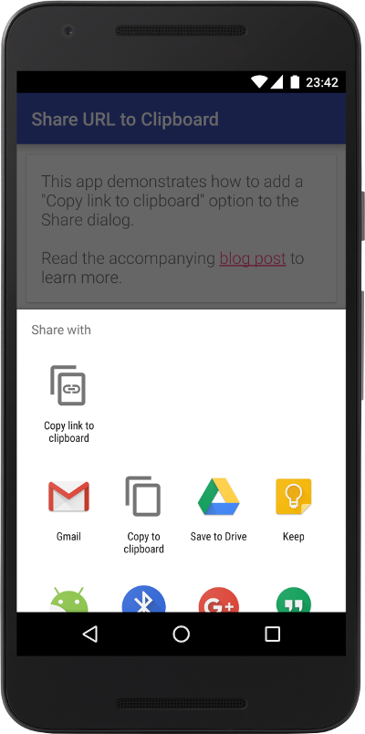

# Share URL to Clipboard Sample App

Android sample app that shows how to add a 'Copy link to clipboard' option to the Share dialog.

Read the accompanying blog post [Share URL to Clipboard](http://cketti.de/2016/06/15/share-url-to-clipboard/) to learn more.

## License

    Copyright 2016 cketti

    Licensed under the Apache License, Version 2.0 (the "License");
    you may not use this file except in compliance with the License.
    You may obtain a copy of the License at

       http://www.apache.org/licenses/LICENSE-2.0

    Unless required by applicable law or agreed to in writing, software
    distributed under the License is distributed on an "AS IS" BASIS,
    WITHOUT WARRANTIES OR CONDITIONS OF ANY KIND, either express or implied.
    See the License for the specific language governing permissions and
    limitations under the License.
